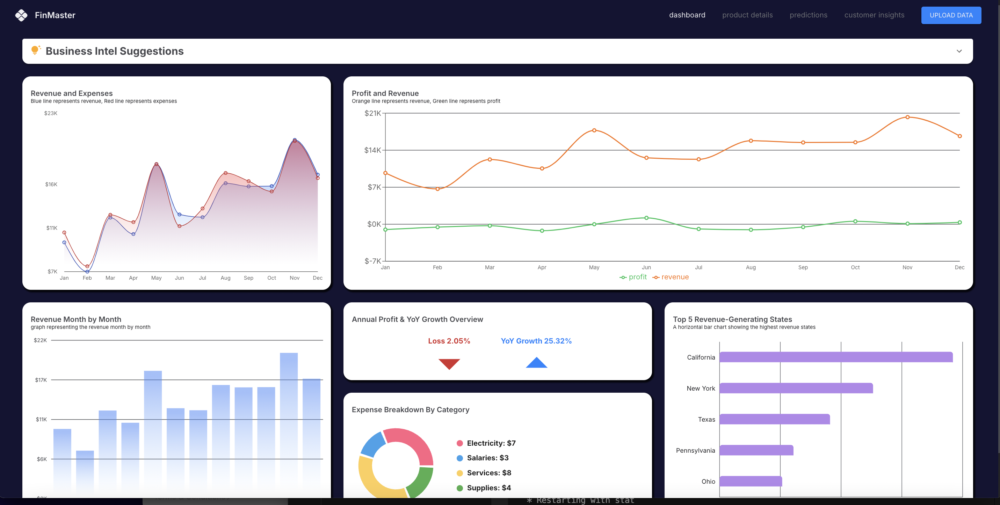
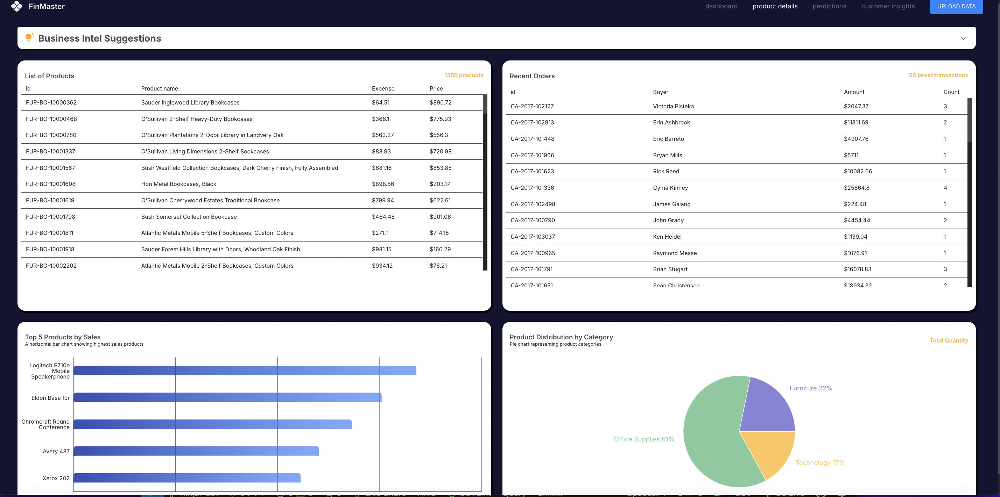
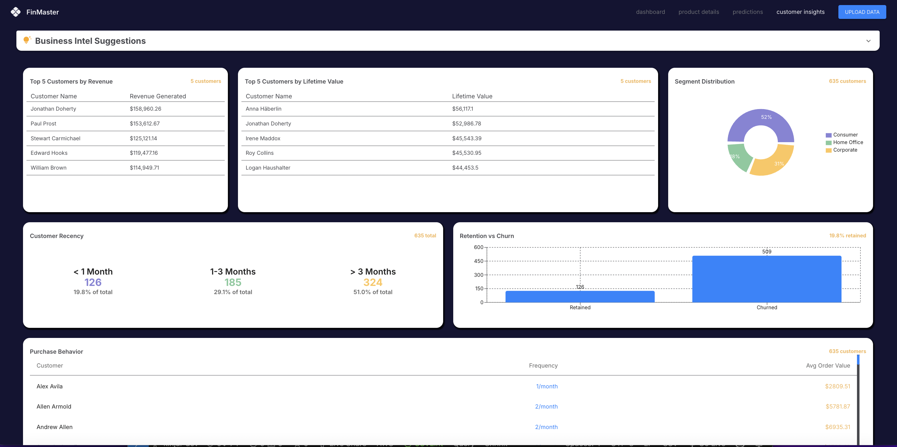
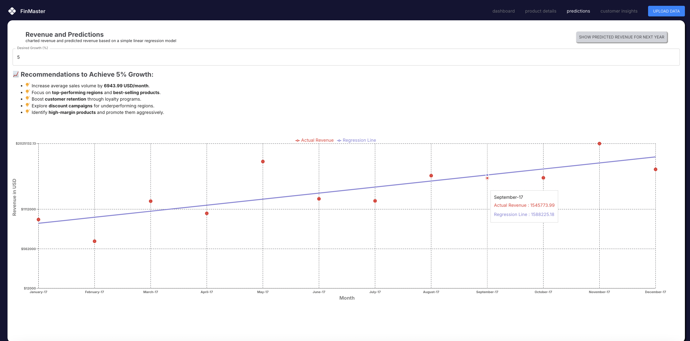
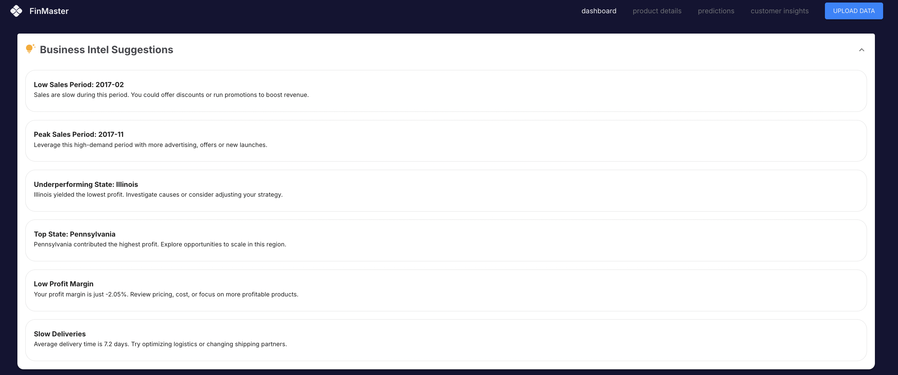

# 📊 FinMaster - Financial Insights Dashboard

FinMaster is an interactive web-based financial dashboard designed for Small and Medium Enterprises (SMEs) to visualize, analyze, and forecast key business metrics. It enables business owners to make data-driven decisions by simplifying complex financial data into intuitive visualizations and actionable insights.

---

## 🌟 Features

- Upload and process financial datasets (CSV format)
- Dynamic visualizations for revenue, expenses, and profit
- Product and customer performance dashboards
- Revenue forecasting using regression
- Business Intelligence suggestions for strategic decisions
- Download-ready dashboards and report generation

---

## 📸 Screenshots

### 🏠 Home Dashboard
_Overall business health through various KPIs and trends._

### 📦 Product & Transaction Insights
_Top products, category analysis, and significant transactions._

### 👥 Customer Insights
_Customer segmentation, LTV, purchase frequency, and recency._

### 📈 Revenue Forecasting
_Predict future revenue trends using regression analysis._

### 🧠 Business Intelligence Suggestions
_Strategic tips based on processed financial data._

---

## 🛠️ Tech Stack

| Frontend          | Backend        | ML/Analytics     | Deployment       |
|-------------------|----------------|------------------|------------------|
| React| NodeJs + Flask | Pandas, NumPy, Matplotlib, Seaborn, regression.js | Render          |

---
